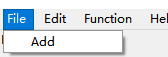
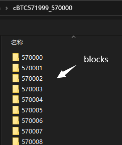
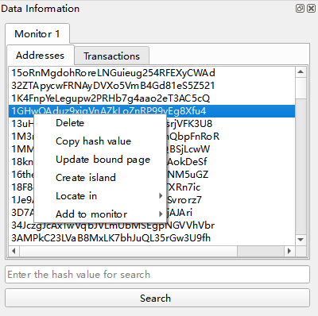
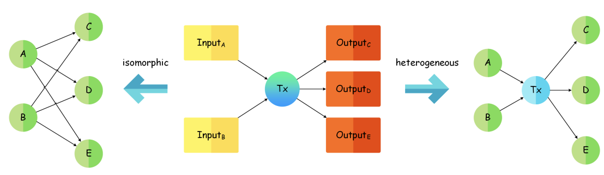
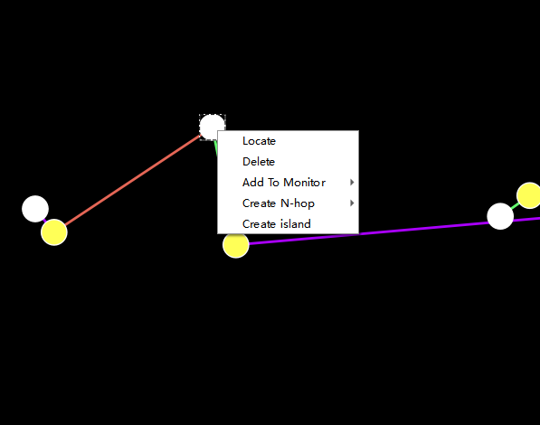
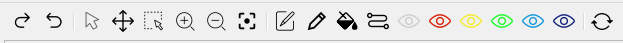
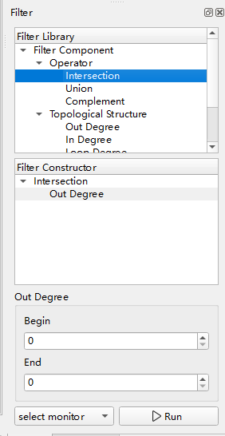

# BTCShadow
BTC Shadow is a highly interactive tool for analyzing and exploring bitcoin data in graph form. Currently, the BTC Shadow is updating. But you can also utilize it.

The tool and examples can be obtained in <a>https://1drv.ms/u/s!AibfqbdWxrYZh38Yp6L8IHqG8qhi?e=md1jwT  and https://1drv.ms/u/s!AibfqbdWxrYZh31Cvz0EHnH7S0OX?e=apjCv4

## Loading data
BTC Shadow supports only one type of bitcoin data, which is obtained by crawling the [website] in JSON format. You can click File - Add and then choose a folder witch contains blocks folders. They look like these below.



And after choosing the number of blocks loaded, the data will be stored in monitor.


## Monitor
The monitor will be created when loading the data or other operations that generates data. It's a list view that shows addresses and hash value of transactions.



In this module, you can:
+ Delete addresses. If all addresses in one transaction are deleted, the transaction will also be deleted.
+ Copy the hash value of selected address.
+ Update bound graph page (<font color="#dd0000" size=2>Warning: The layout of graph must be generated manually. It can't generate automatically.</font>).
+ Create island. Generate the biggest connected graph of selected address.
+ Locate in. Find where the selected address is in any graph pages.
+ Add to monitor. Add the selected address to another monitor.

## Graph page
When call ___Update bound page___ function of monitor, it will create a corresponding graph page in center. Each monitor corresponds to each graph page. The bound graph page will be removed if corresponded monitor is removed.


Graph page aims to show the graph of bitcoin data in isomorphic or heterogeneous form. 

In an isomorphic graph, white node represents account and cyan line represents flow of bitcoins. 

In a heterogeneous graph, white node represents account, yellow node represents transaction, green line represents the flow of bitcoins from transaction to account, red line represents the flow of bitcoins from account to transaction and purple line represents the bidirectional.



In this module, you can:
+ Scroll the wheel of mouse to zoom view.
+ Click with left mouse key and drag mouse to drag the view
+ Click with left mouse key on node to select a node.
+ Locate selected node.
+ Delete selected node.
+ Add selected node to monitor. 
+ Create N-hop graph of selected node.
+ Create island(the biggest connected graph) of selected node.

## Toolbar for graph
Toolbar contains a set of tools for graph page, which can move view or change the color of item in graph to illustrate analytical results. Each button from left denote:



+ Redo the operation that edits graph 
+ Undo the operation that edits graph
+ Click mode
+ Drag mode
+ Multi-selection mode
+ Zoom in
+ Zoom out
+ Back to graph center
+ Edit the label of one selected node.
+ Edit the color of one node. Choose a color first and then click one node to change the color of it.
+ Edit the color of nodes by rules. There are three rules:
    + Connection. When using this rule, the nodes around the clicked node will be colored by circle and circle according to the number of clicks.
    + UTXO. This is similar to Connection, but the nodes of neighbor circles must have relationship of UTXO.
    + Label. Edit color of all nodes that have same the label.
+ Find the path between two nodes and color it.
+ Transform to heat map by rules that can be customized. 
+ Reset the graph.

## Attributes and context display
This two modules display attributes of selected node and information of monitor in text form. The information displayed can be customized. Specifically, you can edit the .ini files in Customization folder. The content looks like:

```ini
[Attribute Name]
# your python code here
# you can use the variable "item" which is the item selected in graph and it's structure is in structure folder
# you must define the value, which is shown in BTCShadow finally
value = *****

[Example]
# here is a example that return the type of item
value = "Account" if isinstance(item, AccountPoint) else "Transaction"
```
And you follow these to define your attribute:
1. define the name of attribute
2. write python code with variables offered.
3. define the variable "value" to end


## Related object
This module will show the items which is related to the selected item in graph. It's in recursive tree form, which means every item in this module will also have a subtree. The depth of root tree depends on settings. You can click with right button in this module to call ___Reset in depth___, which can set the depth of root tree.


If you click an input item or an output item with right button, you can call ___Trace/Follow the UTXO(5)___ where ___5___ means the depth of trace or follow. And the result is that the road that utxo passed will be colored in red.

## Filter
This module is for filtering out the account that you don't want. It consists of three parts: filter library, filter constructor and filter parameter.



You can follow these operations:

1. Drag the filter component from filter library to filter constructor. A filter component can be the child or sibling of one filter component.

2. Set the parameter of filter component in filter constructor.

3. Select a monitor for the final filter that your constructor and click Run button.

Then you will get a new monitor after filtering. The customization of filters is similar to attribute and the details can be found in .ini files.

## Distribution
This module offer to conduct an analysis, which is shown in a chart.


[website]: https://btc.com/api-doc
